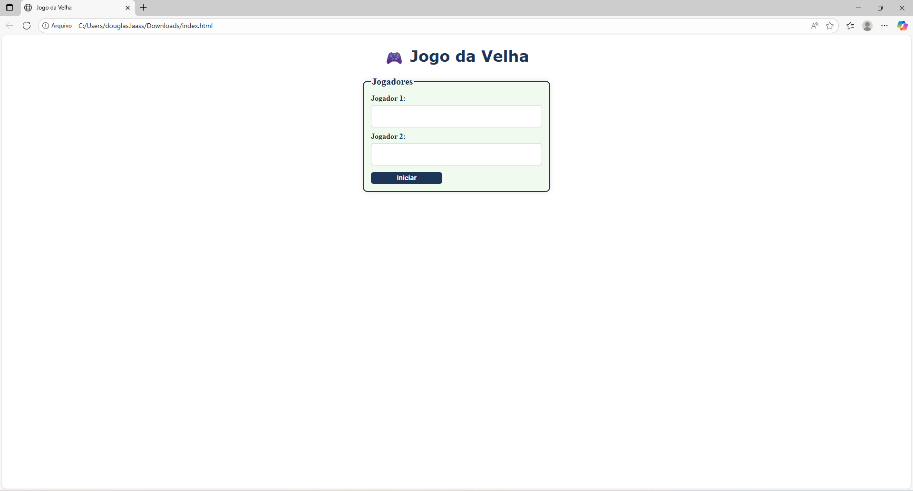
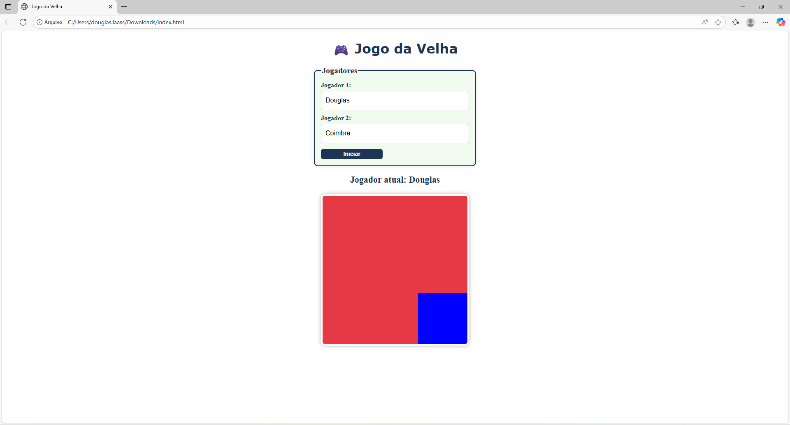
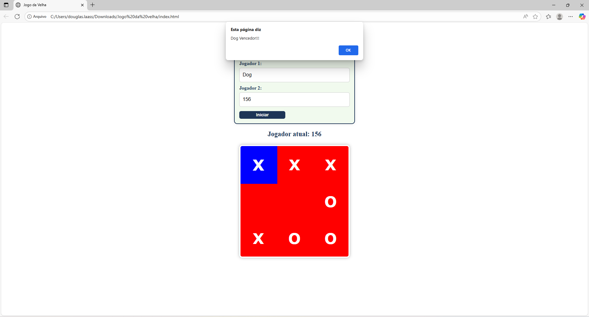

<h1> # 🎮 Jogo da Velha  </h1>

Projeto desenvolvido durante o **minicurso “TI - Criando um jogo com JavaScript”**, ministrado pelo **professor Adriano**, no **evento da Semana de Curso Wyden (02/2025)**.  

---

## 🧩 Descrição do Projeto  

O **Jogo da Velha** foi desenvolvido utilizando **HTML, CSS e JavaScript** em um **único arquivo**, com o objetivo de aplicar conceitos fundamentais de **lógica de programação**, **manipulação do DOM** e **interatividade com o usuário**.  

O jogo permite que dois jogadores insiram seus nomes, alternando as jogadas no tabuleiro de 3x3, com detecção automática de **vitórias em linhas, colunas e diagonais**, além da verificação de **empate**.  
---

## 🕹️ Quer jogar?

Clique no link a seguir e acesse: https://coimbradouglas.github.io/JogodaVelha_JAVASCRIPT/

---

## 🚀 Tecnologias Utilizadas  

- **HTML5** → estruturação da interface do jogo.  
- **CSS3** → estilização do tabuleiro e campos de entrada.  
- **JavaScript (puro)** → controle de jogadas, verificação de vitória e reinício automático.  

---

## 📚 Funcionalidades  

✅ Cadastro dos dois jogadores.  
✅ Alternância automática entre jogador X e O.  
✅ Verificação de vitória (linhas, colunas e diagonais).  
✅ Detecção de empate (tabuleiro completo sem vencedor).  
✅ Reinício automático após o fim da partida.  
✅ Interface colorida, responsiva e interativa com efeitos de hover.  

---

## 🧠 Conceitos Aplicados  

- Estruturas condicionais e funções JavaScript.  
- Manipulação dinâmica de elementos HTML via DOM.  
- Estrutura de dados com **arrays** para representar o tabuleiro.  
- Controle de fluxo do jogo e verificação de estados.  

---

## 🖼️ Interface  

1.Tela de Cadastro dos dois jogadores.

2.Tela de Exibição do tabuleiro

3.Tela de Jogo finalizado

